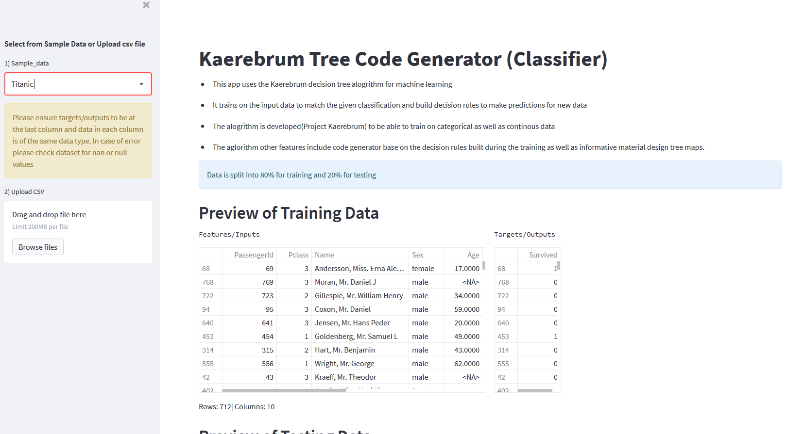
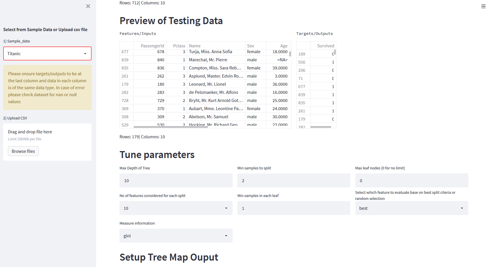
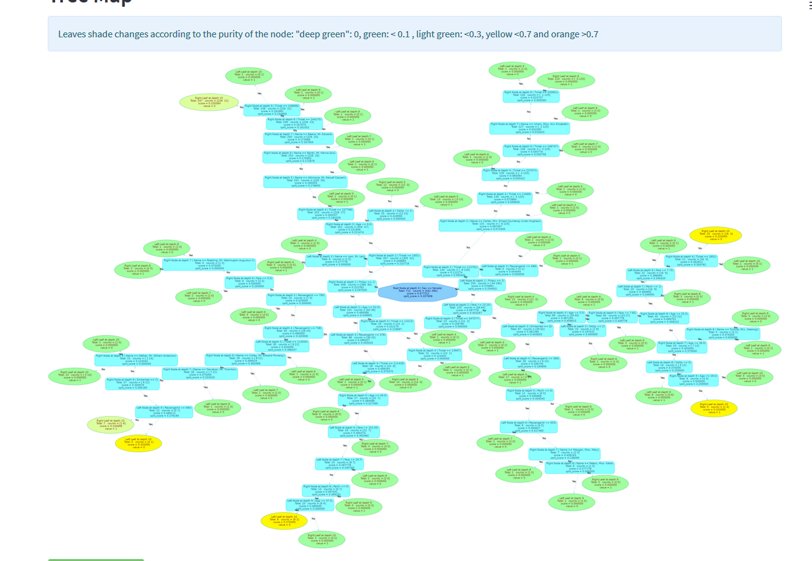
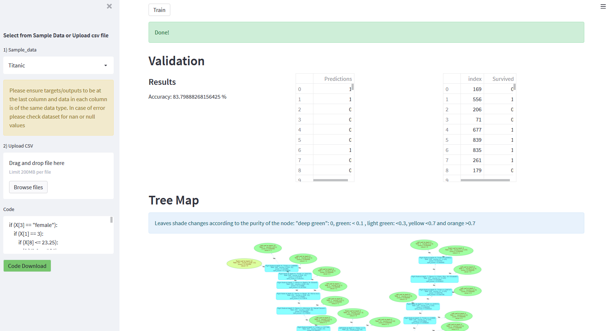

# KaerebrumTree-Decision_Tree_Generator
### Decision Tree Application to 
1.  draw decision tree maps 
2.  Nice detailed tree maps with choice of map layouts
3.  generate decision rules as code for reproduction
4.  able to train categorical data

The algorithm is build from scratch using numpy and graphviz.\
Using streamlit for quick frontend deployment of a nice looking dashboard.

<h2 align="center">Project View</h2>

***
[Link to live app](https://kaerubrumtree.herokuapp.com/)

<h3 align="center"> Submit data for prediction </h3>

<h3 align="center"> Tune parameters to get desired output </h3>

<h3 align="center"> Different map layout to choose from and to be downloaded </h3>

<h3 align="center"> Outputs prediction as well as report  and generate decision rules as code for replication  </h3>

